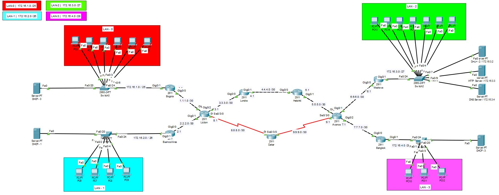

# Enterprise Network Design

This project was developed as my Computer Engineering graduation project using Cisco Packet Tracer.

The aim of the project is to design and simulate a wide area network consisting of multiple local area networks and provide communication between them using the OSPF routing protocol.

## Technologies and Concepts

- Cisco Packet Tracer
- OSPF Routing Protocol
- IPv4 Addressing and Subnetting
- DHCP
- DNS
- HTTP
- Routers and Switches
- LAN / WAN Design

## Network Structure

The simulated network includes:

- 9 Cisco 2911 Routers
- 4 Cisco 2960-24TT Switches
- 6 Servers
  - 4 DHCP Servers
  - 1 HTTP Server
  - 1 DNS Server
- 20 Client PCs
- 4 Local Area Networks

### LAN Addressing

- LAN-0: `172.16.1.0/25`
- LAN-1: `172.16.2.0/26`
- LAN-2: `172.16.3.0/27`
- LAN-3: `172.16.4.0/28`

## Project Features

- OSPF was configured to provide routing between different networks.
- DHCP servers dynamically assign IP configuration to client computers.
- DNS service resolves the `iste.com` domain name to the HTTP server.
- An HTTP server was configured and accessed from clients located in different LANs.
- Connectivity between different networks was tested using ping and routing commands.
- OSPF neighbor relationships and routing tables were verified through Cisco IOS commands.

## Network Topology

## Project Files

- `Enterprise-Network-Design.pkt` — Cisco Packet Tracer project file
- `topology.jpg` — Full network topology
- `ospf-neighbors.jpg` — OSPF neighbor verification
- `routing-table.jpg` — Routing table verification
- `dns-service.jpg` — DNS configuration
- `web-access-test.jpg` — HTTP access through the configured domain name

## Result

The simulation successfully provided communication between devices located in different LANs. OSPF routing, DHCP address assignment, DNS resolution and HTTP server access were tested within the designed network.
